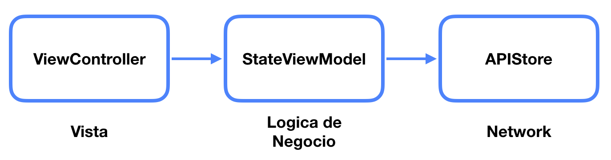

# Movies

## Arquitectura del proyecto

El `APIStore` es responsable de devolver los observables que devuelven información 

## Clases

- `Model` y sus subclases son responsables de parsear (utilizando `SwiftyJSON`) las respuestas del la API.

- Protocolo `RouterRequest`, cada struct que implementa este protocolo 

- `APIStore` y `NetworkStore` son reponsables de generar los observables que hacen el request a la API (o devuelven los request cacheados)

- `StateViewModel` y subclases son los responsables de susbcribirse a los observables que devuelve el `APIStore` y transformar la respuesta en un array de `Section` y setear el `state` el cual es observado por el ViewController

- `Row` representa una celda en un `UITableView` (o `UICollectionView`)

- `Row` representa una sección de celdas en un `UITableView` (o `UICollectionView`). Cada `Section` tiene un array de `Row`

## Preguntas

#### 1. En qué consiste el principio de responsabilidad única? Cuál es su propósito?

El principio de responsabilidad única describe que cada objeto/módulo/clase es responsable de realizar una única tarea. 

#### 2. Qué características tiene, según su opinión, un “buen” código o código limpio

Un codigo limpio es aquel que

- Las responsabilidades de las clases están claramente definidas y no se superponen
- Define nombres claros para las clases, metodos y variables
- Respeta el mismo styling del código (sirve usar lint para esto)
